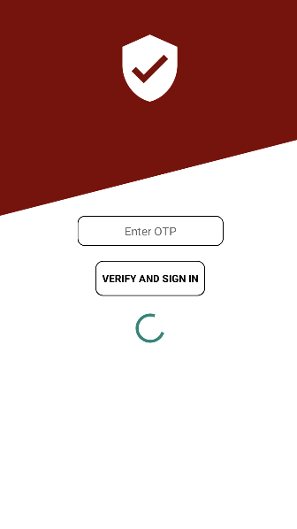

# Home Services Everywhere
Simple concept app made for providing day-to-day services such as : Electricians, Plumber , Carpenters etc.  

 |  |  | 
### App Features 

   * The app utilizes mobile phone authentication for user login.
   * Upon initial sign-in, users input their details, allowing the app to perform CRUD operations on user data.
   * Users have the option to book services through the app, where confirmation is requested before finalizing the booking. Bookings are then displayed in the app's booking section.
   * Users retain the ability to cancel bookings until either the client or service provider confirms the booking. Once confirmed by the client, bookings cannot be canceled.

      
### Dependencies Used
   * Firebase Auth – used for mobile based authentication service.
   * Firebase Firestore –  database which is used to store and perform operations on all of the users data like personal details , orders etc.

### Concepts Covered
   * Fragments
   * Navigation Drawers
   * Firebase Auth and Firestore for android
   * DAO
   * ViewPager
   * RecycleView
   * Firestore Recycle Adapter
   * No Sql Database design
   * Intent
   * User-Permissions
   * Layout Design (XML)
   * Dialog Box
   * Toast Messages
   
